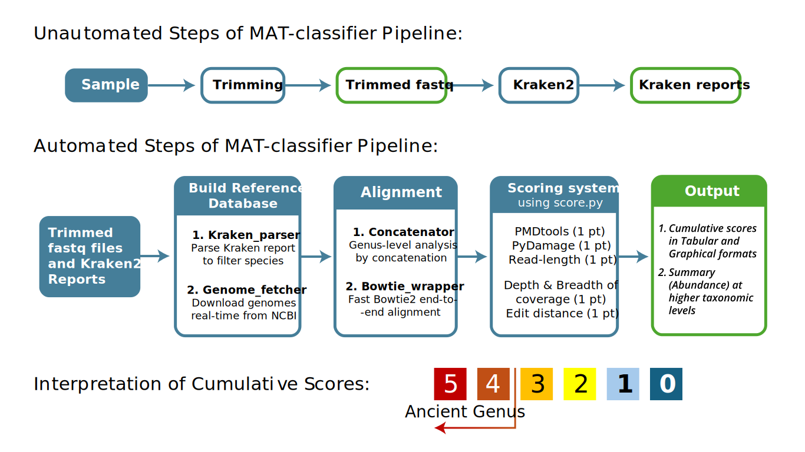

# MAT-classifier: A memory-efficient and accurate ancient microbe classifier pipeline from metagenomic data

Metagenomic Ancient Taxa Classifier (MAT-classifier) is a Bowtie2-based taxonomic profiler pipeline for ancient microbiome studies. The strategies adopted by this pipeline help reduce the computational resource requirements while maintaining superior classification accuracy. MAT-classifier is written in Python and requires conda for dependencies. The pipeline needs two external steps which are not automated:
1. Quality control and adapter trimming of raw reads (e.g. using Fastp (Chen et al., 2018), cutadapt (Martin, 2011), etc.)
2. Kraken2-based taxonomic profiling to select putative taxa (using Kraken2 (Wood et al., 2019))

The main steps of MAT-classifier are shown in the figure below:



## Authors
* Aranya Dhibar - aranyad@utexas.edu
* Mikhail V Matz - matz@utexas.edu

## Citation
If you use MAT-classifier in your work, please cite the following paper: <to be updated>
 
## Installation 

1. Install [Miniconda](https://docs.conda.io/en/latest/miniconda.html) or [Anaconda](https://www.anaconda.com/products/distribution) if you don't have it already.
   
2. For trimming step, install preferred trimming tools for quality control and adapter trimming of raw reads (some examples are Fastp, cutadapt, etc.).  
3. Install Kraken2 using conda (for other options, see [Kraken2's github](https://github.com/DerrickWood/kraken2/wiki/Manual)):
   ```
   # to install in a new conda environment
   conda create -n kraken2_env bioconda::kraken2
   # or, to install in the current conda environment 
   conda install bioconda::kraken2
   ```
4. Clone this repository and create a new conda environment using the environment.yml file:
   ```
   git clone https://github.com/AranyaDhibar/MAT-classifier.git
   cd MAT-classifier
   conda env create -f environment.yml
   ```
5. As of version 1.0.0, Kaleido (a package used by MAT-classifer's graphical modules) requires Chrome to be installed. If you already have Chrome on your system, Kaleido should find it; otherwise, you can install a compatible Chrome version using the kaleido_get_chrome command:
   ```
   conda activate mat_classifier
   kaleido_get_chrome
   ```

## Usage
To illustrate the usage of MAT-classifier, we provide instructions to donwload the test dataset in the `test_data` folder. It contains the trimmed sequences of the 10 samples used in the original MAT-classifier paper, so skip step 1 when testing with the provided data. 

1. Trim the raw reads using preferred trimming tools. We included an example script `trimming.sh` for trimming using cutadapt which we used to generate the `test_data`. MAT-classifier currently only supports single-end reads, hence we recommend to either merge or concatenate the paired-end reads for further analysis. A simple way to concatenate the paired-end reads is shown below:
   ```
   cat R1.fastq R2.fastq > combined.fastq
   ```

2. Build Kraken2 database as per your requirement. We recommend to check the prebuilt databases available [here](https://benlangmead.github.io/aws-indexes/) which can save effort and time. To build a custom database, please refer to the [Kraken2 manual](https://github.com/DerrickWood/kraken2/wiki/Manual). 
3. Run Kraken2 on the trimmed reads. We included a example script `kraken_run.sh` for running Kraken2 on multiple samples. Make sure to use the flag `--report-minimizer-data` in Kraken2 command, otherwise MAT-classifier analysis will not run successfully. You can download the Kraken2 reports of the test dataset as per the instructions in the `test_data` folder. 
4. Update the `config.txt` file with appropriate paths and parameters (see [Config](#config-options) section). 
5. Run MAT-classifier using the command below:
   ```
   conda activate mat_classifier
   python mat_classifier.py <path_to_config.txt>
   ```

## Config options
The config file with instructions is shown below. Please update the paths and parameters as instructed. **Do not change the Left hand side of the `=` sign.** A sample `config.txt` file for the `test_data` is included in the repository.
```yaml
# Sample Table; must be a tab-separated table
# CAUTION: don't use "=" and space in the names
# Format - sample_name \t merged_fastq_path \t kraken_report_path
# Exanple:
sample1  data/sample1_trimmed.fastq.gz data/kraken_sample1_report
sample2  data/sample2_trimmed.fastq.gz data/kraken_sample2_report

# genome search and download
# required
email = <your_email_address>
# [optional] - NCBI API key - recommended for faster downloads - remove it if not used 
# To obtain your API key, make a NCBI account and follow the steps mentioned in the website: 
# https://support.nlm.nih.gov/kbArticle/?pn=KA-05317
ncbi_api = <your_ncbi_api_key>

# Bowtie Options
# Number of CPU cores to use - please use the maximum number of cores you can allocate for better speed
batch_size = <number_of_cores_you_want_to_use>  
# Attempts for bowtie2 alignments in case first attempt failed (>1)
bowtie_retries = 3

# Pmdtools options
# NOTE: pmd library type can be only three options - UDGplus |  UDGhalf | UDGminus
pmd_library_type = UDGhalf
# Minimum fraction of reads with PMD score >= pmd_threshold to consider a taxon ancient
# Note that this fraction is dynamically reduced up to 1% with the species number under genus increases
min_fraction = 0.05 
pmd_threshold = 3

# pydamage options - number of cores to utilize during pydamage analysis
process = 16

# relative or full path of the scripts directory with respect to the MAT-classifier.py script
script_dir = <path_to_scripts_directory>

# Optional plots: Visualization of genus or species abundance at higher taxonomic levels
# NOTE: Species-level abundance aren't accurate as they include both ancient and modern species 
# Do you want these optional plots? options: yes or no
agglomerate_and_plot = yes
# Taxonomic level? options: phylum, class, order, family, genus
rank = family
# Abundance of? options: species or genus
abundance_by = genus
```

## Main Outputs

MAT-classifier generates one folder per sample in the current working directory with the `sample_name` as the folder name. These folders contains all the intermediate and final output files for that sample. Alongside these folders, MAT-classifier generates cumulative results for all samples in the current working directory. These output files are described below:
1. `aggregated_scores.csv` - A table with the cumulative scores per genus per sample with samples as columns and genera as rows.
2. `aggregated_filtered_scores.csv` - The same table of cumulative scores per genus per sample but only contains genera with sufficient confidence to be ancient (cumulative score > 3 in at least one of the samples).
3. `aggregated_putative_anc_microbes` (html and png): A heatmap of the putative ancient genera (cumulative score > 3) across all samples. The color intensity represents the cumulative score. The html file is interactive, whereas the png file is a static image.

If the optional agglomerate plotting is enabled in the config file, the abundance plots will also be generated in the current working directory as `ancient_taxa_abundance_barplot` and `ancient_taxa_abundance_heatmap` (both in html and png format). The underlying data for these plots is also saved as `ancient_abundance_matrix.tsv` in the current working directory. These plots represent the abundance of putative ancient genera at a higher taxonomic level (as selected by the user) across all samples. We also included the option to use the abundance of species underlying ancient genus for these plots, but please note that species-level abundance aren't accurate as there is no species-level verification in our pipeline.

## Useful Notes
### Reduce memory usage:
Kraken2 is the most memory intensive step of the pipeline. Hence, to reduce memory load, use a capped database in Kraken2. The smaller the database is, the less memory Kraken2 will use. Please refer to the [Kraken2 manual](https://github.com/DerrickWood/kraken2/wiki/Manual#build) for building a custom database and use the `--max-db-size` flag to cap the database size. Also, check the prebuilt capped databases available [here](https://benlangmead.github.io/aws-indexes/).  

However, using a smaller database may reduce the sensitivity of the taxonomic profiling. Our paper showed that the reduction in sensitivity is reasonable as it still maintain a considerable accuracy gain compared to other pipelines. A database size of 20-30GB is a good compromise between memory usage and classification accuracy.

### Continue incomplete analysis:

If the pipeline stopped prematurely or you want to continue an incomplete analysis, simply rerun the same command:
```
python mat_classifier.py <path_to_config.txt>
```
The pipeline will automatically detect the completed steps and continue from where it left off.

### Rerun from intermediate steps:
If the pipeline stopped prematurely or one intermediate step need to be rerun, you can pass the `force` flag with the specific step name from which you want the pipeline to re-analyze. The available options for this flag are: `genome`, `concatenate`, `bowtie`, `pydamage`, `pmdtools`, `authentication`, and `scoring`; each step name corresponds to the main steps of the pipeline. For example, if you want to rerun the analysis from bowtie step, use the command below:
```
python mat_classifier.py <path_to_config.txt> --force bowtie
```
Keep in mind that the `force` flag will rerun the specified step and all the subsequent steps for new output. Note that the `genome` option will not re-download the genomes which already exist. If you want to re-download all or specific genomes, you need to delete those from `fna_files` directory first.

### Force rerunning the entire pipeline:
To force rerun the whole analysis, you can either delete all the folders and outputs (most importantly the genome_fetch.finish file and fna_files directory) generated by MAT-classifier or use the `force` flag with `genome` option after deleting the fna_files directory:
```
rm -rf fna_files
python mat_classifier.py <path_to_config.txt> --force genome
```

### Speed up genome download:
To speed up the genome download step, you can provide your NCBI API key in the `config file`. To obtain your API key, make a NCBI account and follow the steps mentioned in the website: https://support.nlm.nih.gov/kbArticle/?pn=KA-05317. The API key will allow you to make more requests per second to NCBI servers, which will speed up the genome download process.

### Use different coverage thresholds for validation:
During the scoring stage, we scored genus-level assignments based on Kraken2 report with passing thresholds: >200 reads (depth of coverage) and >1000 unique k-mers (breadth of coverage). These values are chosen based on available cutoffs in literature (Pochon et al., 2023) and our empirical tests. However, you can use different cutoffs by modifying the authentication_runner.py script. On line 23 of this script, locate the line below:
```
    filtered_report = report[(report['fragments_clade'] > 200) & (report['distinct_minimizers'] > 1000)].copy()
```
You can change the values `200` and `1000` to your desired cutoffs for depth and breadth of coverage, respectively.

## References
1. Chen, S., Zhou, Y., Chen, Y., & Gu, J. (2018). fastp: An ultra-fast all-in-one FASTQ preprocessor. Bioinformatics, 34(17), i884–i890. https://doi.org/10.1093/bioinformatics/bty560
   
2. Martin, M. (2011). Cutadapt removes adapter sequences from high-throughput sequencing reads. EMBnet.Journal, 17(1), 10–12. https://doi.org/10.14806/ej.17.1.200
   
3. Wood, D. E., Lu, J., & Langmead, B. (2019). Improved metagenomic analysis with Kraken 2. Genome Biology, 20(1), 257. https://doi.org/10.1186/s13059-019-1891-0
   
4. Pochon, Z., Bergfeldt, N., Kırdök, E., Vicente, M., Naidoo, T., van der Valk, T., Altınışık, N. E., Krzewińska, M., Dalén, L., Götherström, A., Mirabello, C., Unneberg, P., & Oskolkov, N. (2023). aMeta: An accurate and memory-efficient ancient metagenomic profiling workflow. Genome Biology, 24(1), 242. https://doi.org/10.1186/s13059-023-03083-9
5. NCBI API key instructions: https://support.nlm.nih.gov/kbArticle/?pn=KA-05317
6. Kraken2 manual: https://github.com/DerrickWood/kraken2/wiki/Manual
7. Prebuilt Kraken2 databases: https://benlangmead.github.io/aws-indexes/